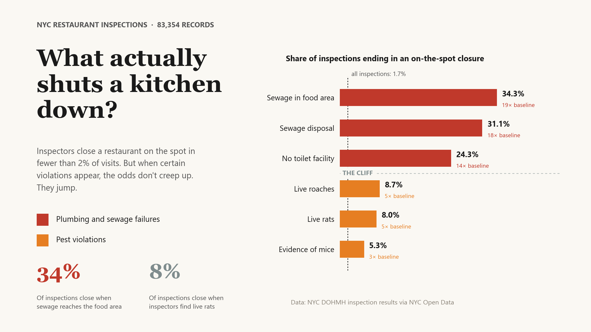

# The Quiet Math of NYC's Restaurant Inspections

A data-backed case study of NYC's restaurant inspection program: what
**83,354 inspections of 27,350 active restaurants** reveal about pests,
plumbing, geography, and what actually gets a kitchen shut down.

> **Live article:** **<https://f-a-tonmoy.github.io/nyc-inspections-case-study/>**

[](https://f-a-tonmoy.github.io/nyc-inspections-case-study/)

Built as a reproducible Python pipeline that profiles, analyses, and renders
a single self-contained HTML article with interactive Plotly charts, scroll-
synced section navigation, animated maps, and a flip-card grade-system
visual. Source data: NYC Open Data dataset [`43nn-pn8j`](https://data.cityofnewyork.us/Health/DOHMH-New-York-City-Restaurant-Inspection-Results/43nn-pn8j).

---

## Headline numbers

| Stat | Number |
|---|---|
| Inspections analysed | **83,354** |
| Active NYC restaurants in the panel | **27,350** |
| Share of inspections finding vermin | **33%** |
| Share of NYC inspections ending in on-the-spot closure | **1.74%** |
| Closure rate when a sewage code appears | **34%** (≈19× the baseline) |
| Inspections at exactly score 12 vs score 14 | **9,858 vs 433** (~23×) |
| Median time to re-inspection after a sewage closure | **6 days** |
| Restaurants with **a clean three-year inspection history** | **993** (≈4%) |
| NYC neighbourhoods (NTAs) where pizza is found | **186 of 194** |

---

## What's in the article

Seven numbered findings + intro + conclusion + a "what this data cannot
tell us" caveat section.

1. **Vermin is everywhere.** One in three NYC inspections find evidence of
   mice, rats, roaches or flies. Borough-to-borough variation is mild;
   neighbourhood-level variation is twice as wide.
2. **The closure cliff.** Most violations don't shut a kitchen down. A
   small handful — sewage codes — do, at roughly 14 to 20× the baseline
   closure rate. Live rats raise the risk by about 5×.
3. **The 13-point ceiling.** Inspection scores pile up sharply at 12 and
   13 (the highest scores that still earn an A) and collapse at 14 (one
   point above the grade boundary). Re-inspections show the same
   discontinuity.
4. **Most kitchens bounce back.** Median wait from a sewage closure to the
   next inspection is just 6 days; 69% are formally re-opened. For
   C-zone (score ≥ 28) failures, the median score drops 22 points on the
   re-inspection, and 58% recover to an A.
5. **NYC's food map is sliced into pockets.** Pizza and Chinese restaurants
   are in 186 of NYC's 194 NTAs. Bangladeshi restaurants are concentrated
   60% in their top 5 NTAs; East Flatbush is 60% Caribbean by restaurant
   count. The map is fractal: radically diverse in some places, radically
   concentrated in others.
6. **The summer effect.** Cold-food temperature violations rise 1.4× in
   summer; hot-food violations actually drop. On-the-spot closures jump
   to 2.0% in summer, against 1.6% in winter. August is the riskiest
   month for a kitchen; May is the safest.
7. **What an 'A' really means.** 87% of graded inspections end in an A,
   but 57% of restaurants needed a re-inspection to get there, and 96%
   have been cited for at least one critical violation in the past three
   years. The A is less a description of kitchen quality than an outcome
   the inspection system is structured to produce.

---

## Tech stack

- **Python**: pandas, numpy for analysis
- **Plotly**: every interactive chart in the article (scatter, bar,
  histogram, choropleth, map)
- **HTML / CSS / vanilla JS**: scroll-synced section nav, scroll-triggered
  map zoom animations, 3D flip-card grade visual, mobile-responsive layout
- **Pillow**: programmatically generated 1200×630 Open Graph preview image
- **No backend, no database, no framework** — the deliverable is one
  self-contained HTML file that runs in any modern browser

---

## Repo layout

```
data/
  README.md               how to download the raw CSV + geojson
  raw/                    gitignored — populated by download_data.py
  processed/              gitignored — produced by build_inspections.py
src/
  download_data.py        Step 1 — pull raw CSV into data/raw/
  build_inspections.py    Step 2 — collapse violations to one row per inspection
  build_article.py        Step 3 — compute findings + render article.html / index.html
  build_og_image.py       Generates the Open Graph preview card (reports/og-image.png)
  build_og_square.py      Square 1:1 variant of the preview card
  build_hero_image.py     Generates the README/social hero card (reports/hero-image.png)
notebooks/
  01_visual_overview.ipynb   initial visual profile (outputs baked in)
reports/
  article.html            THE CASE STUDY — open in any browser
  hero-image.png          hero / cover card (2400×1350)
  og-image.png            link-preview card (1200×630)
  og-image-square.png     link-preview card, square (1200×1200)
  data_dictionary.md      column-by-column notes on the raw CSV
  source_notes.md         official dataset description + annotated implications
index.html                the article, served at the Pages root
requirements.txt          Python dependencies
```

---

## How to reproduce

Requires Python 3.10+ and the packages in `requirements.txt`
(pandas, numpy, plotly, pyarrow, Pillow, matplotlib).

```bash
# 1. Set up a virtual environment (use whatever you like — venv, conda, uv, ...)
python -m venv .venv
source .venv/bin/activate          # Windows: .venv\Scripts\activate
pip install -r requirements.txt

# 2. Download the source data (see data/README.md for details)
python src/download_data.py

# 3. Build the analysis-ready table
python src/build_inspections.py

# 4. Render the article
python src/build_article.py
# -> writes reports/article.html and index.html (the page Pages serves)

# 5. (Optional) regenerate the preview and hero cards
python src/build_og_image.py
python src/build_hero_image.py

# 6. Preview locally
python -m http.server 8000
# open http://localhost:8000/
```

The article HTML is self-contained: all CSS is inline, Plotly loads from CDN,
and there are no other local asset dependencies.

> **Note on reproducibility.** Because DOHMH updates the published file
> daily and the file is a rolling three-year window, numbers reproduced
> against a fresher download will be close but not identical to the ones
> quoted in the article. The article's snapshot was taken in late May
> 2026. Patterns and rankings are stable across snapshots; exact
> percentages drift by fractions of a point.

---

## Key conventions in the data

- **`SCORE`** is DOHMH's inspection metric where **higher = worse**. `GRADE`
  (A / B / C) is derived from the score by DOHMH; this pipeline never
  recomputes it.
- **Grain:** the raw CSV is **one row per violation**, so a single inspection
  (one `CAMIS` on one date) spans multiple rows. `build_inspections.py`
  collapses it to one row per `(camis, inspection_date)`.
- **Coverage:** the published file is a **rolling ~3-year window** of active
  restaurants. The pre-2022 records are a sparse tail (under 300/year through
  2021); everything in the article uses inspections from mid-2022 onward.
- **Active-status filter:** restaurants that permanently closed or lost their
  permit drop out of the file entirely. The article's closure rates therefore
  describe surviving restaurants only.
- **"Closure" has two meanings in the data**, distinguished explicitly in
  the article's "What this data cannot tell us" section: on-the-spot
  regulatory closures (temporary, kitchen stays in the file) vs. permanent
  business closures (kitchen drops out of the file entirely).

---

## License

The analysis code in this repository is released as-is for portfolio /
educational use. The underlying inspection data is published by the City of
New York under the [NYC Open Data terms of use](https://www.nyc.gov/home/terms-of-use.page).
